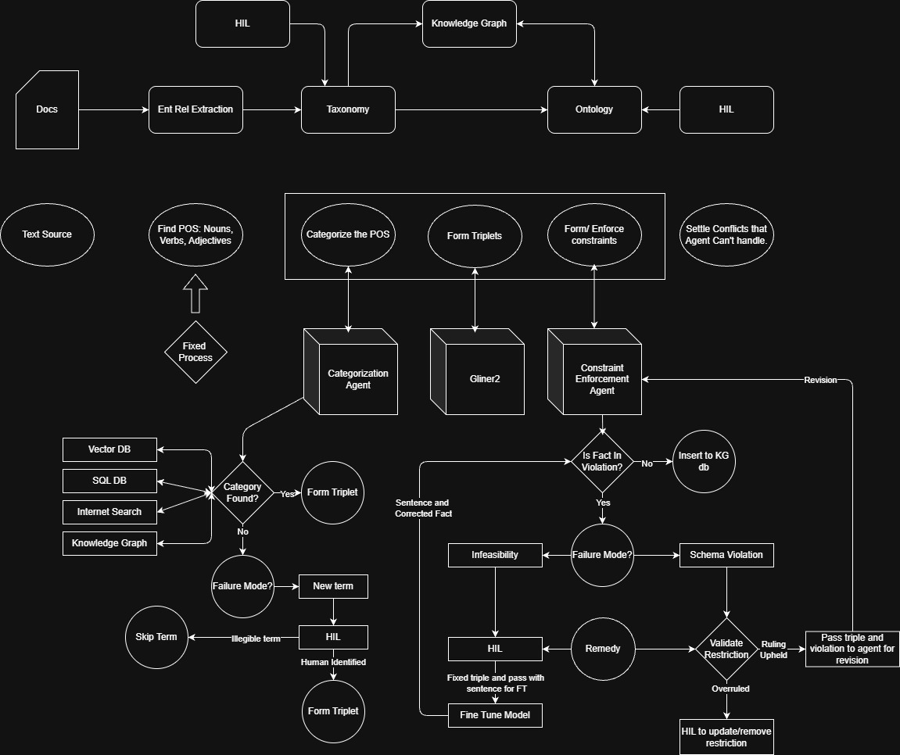
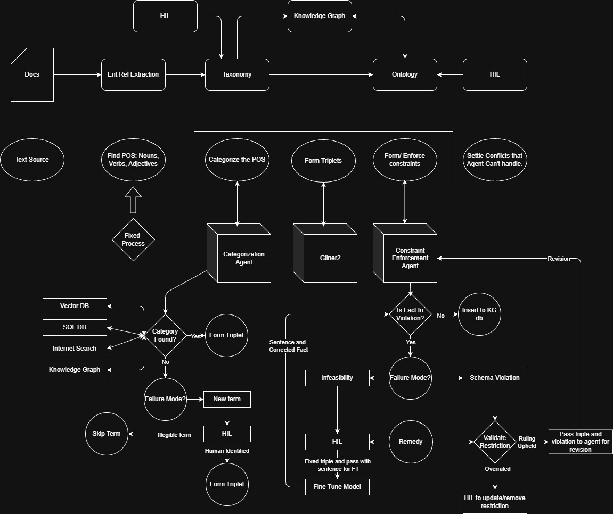

# AutoGraphAI
Automatic generation of Knowledge Graphs (KG) and Ontologies from unstructured text to support robust Agentic context compression using Graph RAG.

### 1. Purpose
Agentic workflows generate a large ammount of context as the complexity of tasks increase. Models must perform inference on this context in order to perform their task, 
which greatly relies on the ability to squeeze the most relevant information into their context windows before data is dropped from it. This project rests on the bet that
*knowledge graphs will unlock the key to long term conversational and agentic context maintenance at scale*.

### 2. Context compression and Memory management
Context compression through generative summarization only delays the inevitable. The only solution thus far has been to increase the number of sub-agents while decreasing 
their scope. Efficient context compression greatly increases the lifetime of an agent before it forgets or hallucinates context.

### 3. Benefits
Knowledge graphs ground LLMs through deterministic relationships between entities (nouns) and are derived directly from human verified knowledge rather than probablstic 
modeling. RAG chunks embed combined context from entire paragraphs, while node-edge chunks embed context more granularly at the N-gram token level. KG retrieval comes after 
multi-hop graph traversal which:

- greatly decreases the likelihood of hallucination
- enables multi-hop reasoning for improved zero shot inference
- represents context with minimal token redundancy
- is natively understood by LLMs

### 4. Automated Knowledge Graph Development
Knowledge graph generation has been a tedious manual/semi-manual process involving Named Entity and Relationship Resolution, Part of Speech designation, Entity De-duplicaiton and Ontology maintenance. Advancements in LLM and harness features/quality reduces the barrier to the establishment and maintenance of KGs. Here, I
describe an agentic approach to KG development using internal and external knowledge bases as context, complete with failure mode handling and Human in the Loop (HIL)
fallbacks. Ideally, reliance on human feedback can become rare with agentic KG construction that is robust to compouning errors and corrects for those errors autonomously.

A basic workflow for KG and ontology generation:

- Docs: Anything containing text or that can be transcribed to text (Docs, PDFs, Audio, Imagery, Video)
- Entity-Relationship Extraction: Given a body of text, extract entities (nouns), relationships (verbs) and adjectives (properties) 
- Taxonomy: Categorize the nouns, verbs and properties according to their meaning and within respective hierarchies
(ex. Supreme Court of The United States -> Federal Judiciary -> Governmental Institution)
- Knowledge Graph: Based on text structure and semantic reasoning, establish subject-predicate-object triplets and their text-derived properties.
- Ontology: Gather set of unique triplets within the KG and establish grounding rules. This is the riskiest task to automate and will be performed by 
human-agent teaming with the human-to-agent task ratio declining over development cycles.
- Human in the loop (HIL): Human intervention and oversight is critical to agents completing their tasks in a sustainable manner, particularly during the seeding 
stages of KG generation where the captured knowledge set is small. As the ontology grows, it captures a greater volume of meaning over a particular domain and
gains more capacity to scrutinize and accurately capture additional domain data.

##### Agentic Information Capture and Failure Mode Handling
